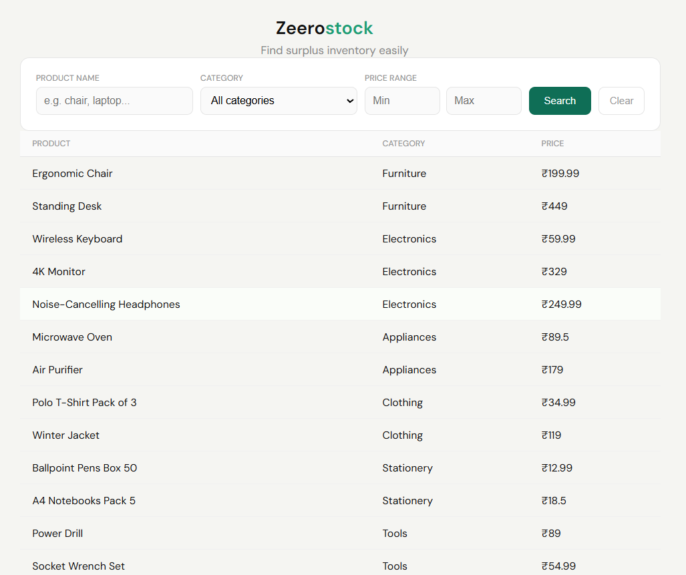
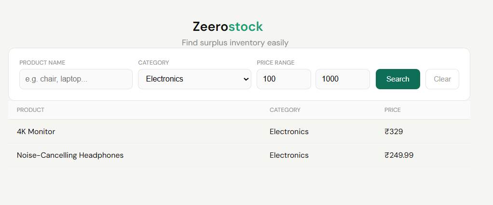

# Inventory Search App (Zeerostock Assignment)

A simple full-stack application that allows users to search surplus inventory using filters like product name, category, and price range.

## Deployed Link : https://inventory-search-dmel.vercel.app/
## 1)Tech Stack:

Frontend - React.js ,CSS 

Backend - Node.js ,Express.js

## 2)Features

Search by product name (partial match, case-insensitive)
Filter by category
Filter by price range (min & max)
Combine multiple filters
Clean, centered UI design

## 3)How to Run Locally

    1) Clone the repository
    git clone https://github.com/akshayreddy116/inventory-search.git
    cd inventory-search
    2️) Run Backend
    cd backend
    npm install
    node server.js
    Backend runs at:
    http://localhost:5000
    3️) Run Frontend
    cd frontend
    npm install
    npm run dev
    Frontend runs at:
    http://localhost:5173

## 4)Screenshots

After Filtering

## 5)Performance Improvement (For Large Data)

Currently, filtering is done in-memory.

For large datasets:

Use database indexing

Implement pagination

Add debouncing on search input
